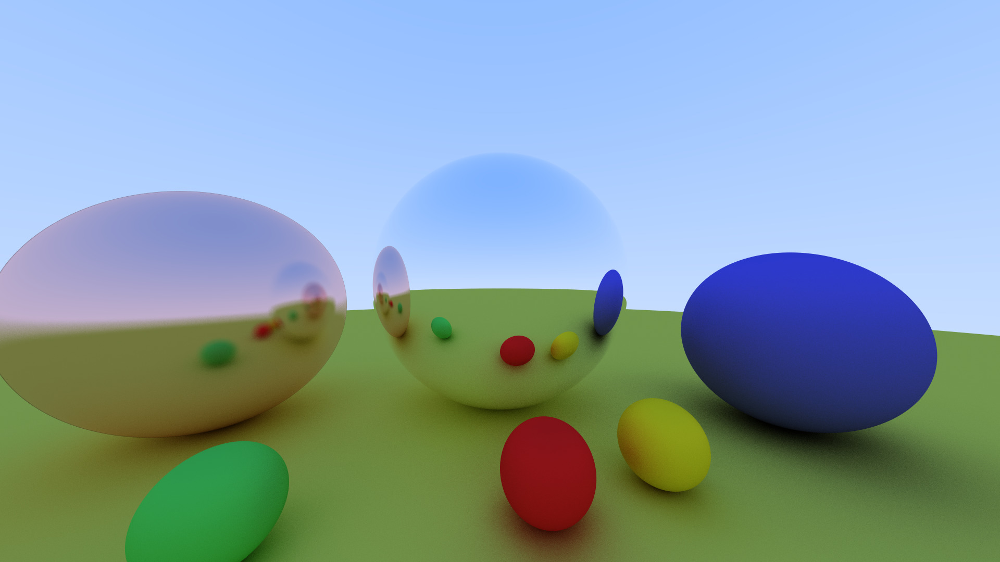

# rtweekend-vhls

This is an implementation of [_Ray Tracing in One Weekend_](https://raytracing.github.io/books/RayTracingInOneWeekend.html) in Vitis HLS.

Example output (1920x1080 256spp in 38 sec)

